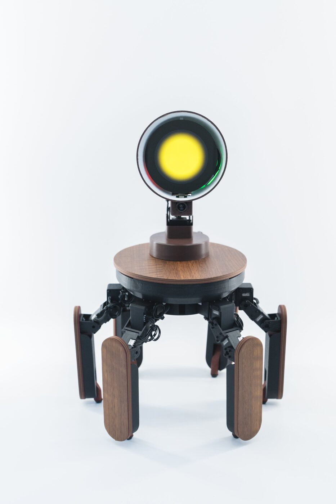
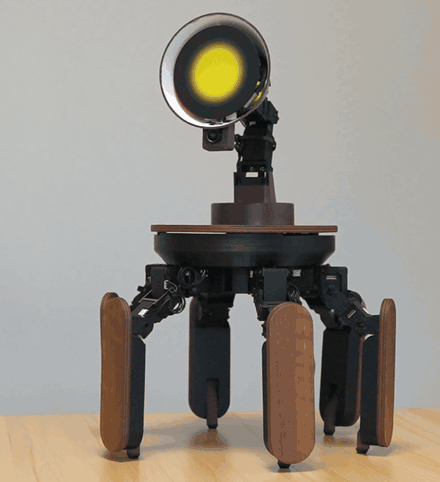
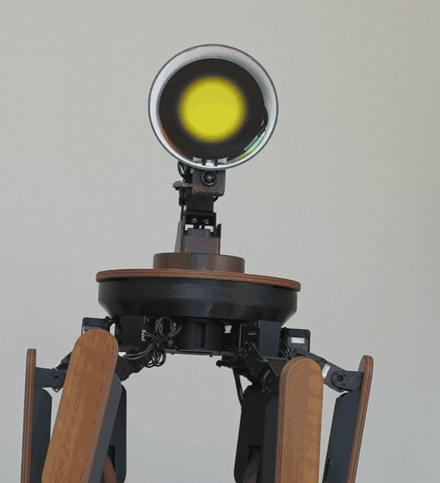
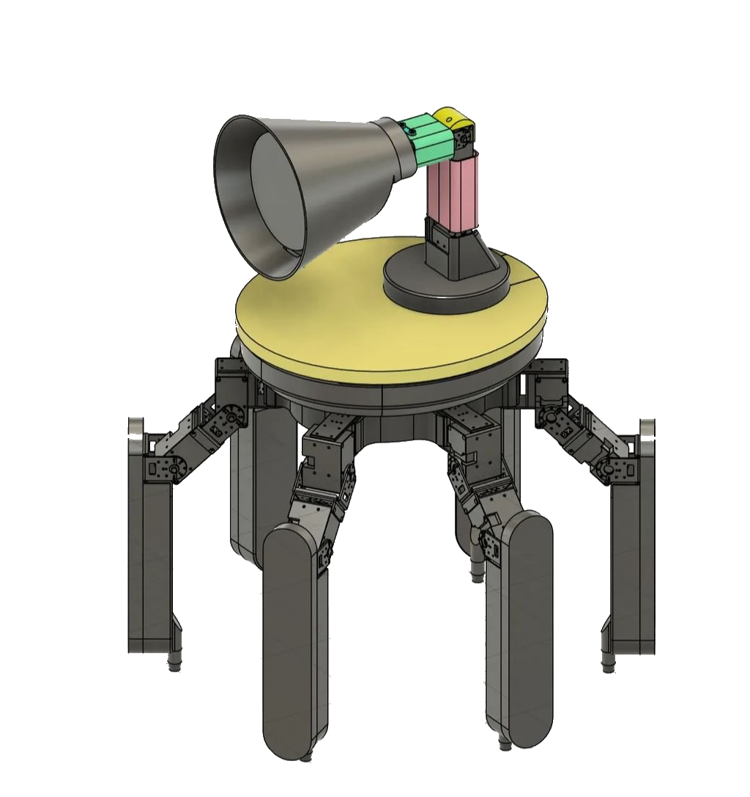
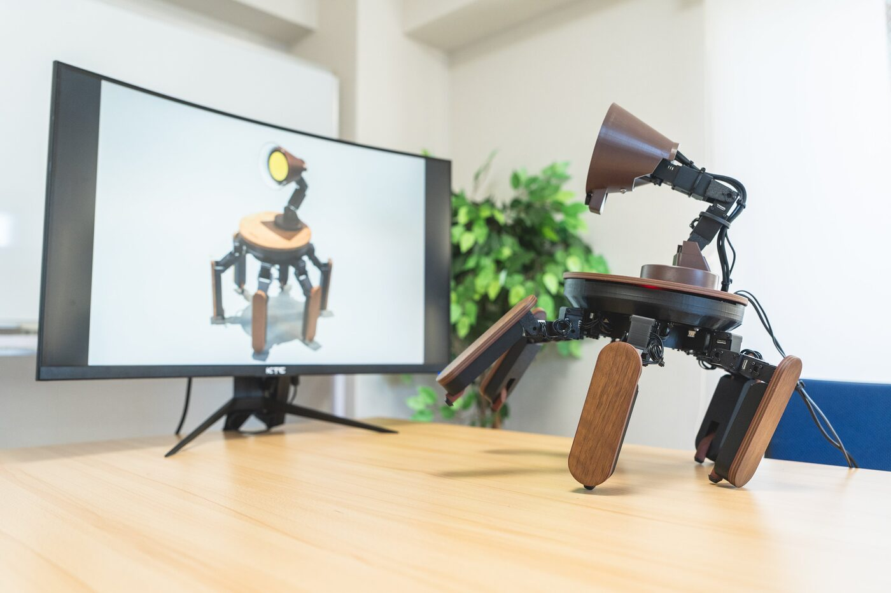

<div align="center">

# Palmimo DevKit

**Give AI agents a body.** Palmimo DevKit is a six-legged tabletop AI robot you drive
with your own Python — open-source SDK, MCP server, and agent examples by
[Jizai Inc.](https://jizai.ai/)

[Website](https://palmimo.dev/en) · [Documentation](https://docs.palmimo.dev) · [Get a DevKit](https://palmimo.dev/en#specs) · [Japanese](https://palmimo.dev)




</div>

Palmimo is a customizable, general-purpose AI robot: a tabletop companion that meets
your eyes, answers your voice, and speaks through expressions and gestures.
**Palmimo DevKit** is its development kit — the robot arrives assembled and tested,
and this repository is the software that runs it: a Python SDK, an MCP server and
agent examples that turn LLM tool calls into robot actions, and the docs.

Under the hood, 18 leg servos walk it on a tripod gait, a servo neck aims a round
face display, and a small expression engine gives it a face — all reachable from a
few lines of Python, with no robotics background required.

The core idea: a single **motion engine** (pure gait + inverse kinematics, no I/O)
drives the robot through interchangeable front-ends — the `palmimo_sdk` Python
API and example agent apps — and every motion computes in dry-run, with no
hardware attached, before it ever reaches a servo.

```
Palmimo.forward() → step() → MotionEngine computes → {servo_name: tick} → ServoDriver → hardware
                                                                     (or compute-only in dry-run)
```

## ✨ Features

- **AI-agent ready** — `palmimo_sdk.agent` turns LLM tool calls into robot actions
  (walk, wave, look, set a face, speak, capture a frame), and the model behind it is
  swappable. `palmimo_sdk.mcp` serves the same tools over MCP to Claude Code,
  OpenClaw, or any MCP client, and the example apps ship a wake-word agent and an
  always-on companion agent — see [Examples](examples/README.md) and
  [Serving over MCP](doc/guides/mcp-server.md).
- **A few lines of Python** — `robot.wave()`, `robot.look(...)`, `robot.forward()`:
  no robotics background needed.
- **18 built-in motions** — walking and turning (`forward`, `strafe_left/right`,
  `rotate_left/right`, `creep`), gestures (`wave`, `bow`, `clap`, ...), and
  poses (`stretch`, `dance`, `pushup`, ...), driven by an anti-phase
  **tripod gait**; see the full list in the
  [motion list](doc/reference/motions.md#available-motions).
- **Pitch/yaw neck** — aimed with `look(pitch, yaw)` independently of, and
  simultaneously with, walking. The neck carries a third joint the motion engine
  leaves at neutral; see [Controlling motions](doc/guides/controlling-motions.md#sending-to-real-hardware-too).
- **Choreography** — sequence `(motion, seconds)` steps via `Palmimo.play_realtime()`.
- **Expressive face** — a parametric (math-drawn, no image assets) expression
  vocabulary (HAPPY, ANGRY, SAD, EXCITED, THINKING, SLEEPY, …) rendered on the
  face-display board over USB-CDC; the host decides the emotion, the board just draws it.
- **Voice (optional)** — `piper-plus` TTS and shared mic-stream capture with
  GTCRN noise removal (`palmimo_sdk.audio`), used by the example agent apps.
- **Python API core** — `palmimo_sdk.Palmimo` drives one `MotionEngine`; example
  agent apps (see [Examples](examples/README.md)) build on it as front-ends.
- **Dry-run first** — every motion computes without hardware, so you can explore
  the whole API with no robot attached.

<div align="center">

 

<sub><code>robot.bow()</code> and <code>robot.wave()</code>, on the hardware.</sub>

</div>

## 🦾 Hardware

Palmimo DevKit ships as an **assembled, tested robot**: 21 serial-bus servos
(18 leg + 3 neck), a round face display, a 5 MP camera, a mic array and stereo
speakers, and a Raspberry Pi 5 (16 GB) as the control host. What the software
talks to, and over what, is in
[System architecture](doc/explanation/architecture.md#execution-model).
Hardware design files are not part of this repository (see
[CONTRIBUTING → Scope](CONTRIBUTING.md#scope-what-lives-here)); full
specifications are on [palmimo.dev](https://palmimo.dev/en#specs).

<div align="center">



</div>

## 🔓 What's open, and what ships

- **Open now (Apache-2.0):** the `palmimo_sdk` Python SDK and drivers, the agent
  layer and MCP server, the example agents and the OpenClaw connection kit, the
  LeRobot plugins, the diagnostics, and these docs.
- **Opening progressively:** more of the development stack beyond the SDK, starting
  with the robot model for simulation and environments for robot learning. Watch
  [Discussions → Announcements](https://github.com/Jizai-inc/palmimo-devkit/discussions/categories/announcements)
  for what lands next.
- **Not published:** the manufacturing design of the hardware. Palmimo DevKit ships
  as an assembled, tested robot — see
  [CONTRIBUTING → Scope](CONTRIBUTING.md#scope-what-lives-here) for where
  hardware-side requests go.

## 🍓 Control host: Raspberry Pi

Palmimo's control host is a **Raspberry Pi 5 (16 GB)**, wired to the servo bus
over USB, and it ships already imaged. The
[Raspberry Pi setup](doc/guides/raspberry-pi-setup.md) guide writes a card from
scratch — Wi-Fi, SSH, and the runtime the Quickstart assumes — whether you are
re-imaging the shipped card or preparing a Pi of your own.

No robot yet? Every motion computes without hardware — skip to
[Try the Python API](#try-the-python-api-no-hardware-needed).

## 🚀 Quickstart

On the Raspberry Pi, over SSH. Prerequisites: **Python 3.12+** and
[**uv**](https://docs.astral.sh/uv/) — the setup guide above installs them on a
card it writes.

1. **Get the code** — `git clone https://github.com/Jizai-inc/palmimo-devkit.git`
   on the Pi.
2. **Install** — `uv sync` from the repository root; the
   [installation guide](doc/guides/installation.md) covers extras, voice models,
   and what to do when an import fails.
3. **Check the servos** — `uv run python scripts/diagnose_servos.py scan` confirms
   every servo answers before the first run. See
   [user diagnostics](scripts/README.md) for the other subcommands.

Commands auto-detect the servo bus; explicit ports are covered where detection
is ambiguous.

> ⚠️ **Test motions in the air before placing the robot on a surface** — read
> [Safety](#-safety) first.

### Try the Python API (no hardware needed)

Save this as `walk.py` in the repository root and run it with
`uv run python walk.py`:

```python
from palmimo_sdk import Palmimo

robot = Palmimo()
robot.forward()
for _ in range(100):
    pos = robot.step()  # dict like {"leg_1_yaw": 2048, ...}
```

`Palmimo()` with no driver attached is compute-only, so this runs with no robot
connected.

<div align="center">



</div>

## 🚨 Safety

This kit drives real, geared servos that can pinch, and runs on mains-derived
power. Before powering the robot:

- **Test every motion in the air first** — abrupt jumps damage gears; new motions
  must transition smoothly to/from the neutral stance.
- Servo targets are clamped to a **safe range (200–3900 ticks)**; avoid the
  mechanical limits at 0 / 4095.
- Watch servo temperature during sustained motion — geared servos overheat under
  load (treat > 70 °C as a warning sign, > 85 °C as stop-now).
- Keep fingers clear of the legs and neck while torque is enabled.
- **Closing the controlling program does not guarantee the servos are released.**
  A clean exit parks the robot and disables torque, but a program that is killed,
  crashes, or is stopped part-way through a motion may not reach that point, and
  the servos then keep holding position — and keep heating — with no process
  left running. **Unplugging the AC adapter is the only certain way to make the
  robot safe to handle.** Do not read "the program is closed" as "the robot is
  off".

The software is provided **“as is”, without warranty of any kind**; you operate the
hardware at your own risk.

## 📖 Documentation

The same pages, rendered: [docs.palmimo.dev](https://docs.palmimo.dev).

**Getting it running**

| Page | What it covers |
|---|---|
| [Raspberry Pi setup](doc/guides/raspberry-pi-setup.md) | Preparing the control host, headless |
| [Installation](doc/guides/installation.md) | Dependencies, voice models, troubleshooting |

**Doing something specific**

| Page | What it covers |
|---|---|
| [Controlling motions](doc/guides/controlling-motions.md) | Driving the robot from your own Python |
| [Serving over MCP](doc/guides/mcp-server.md) | Exposing the robot's tools to an MCP client |
| [Adding a new motion](doc/guides/motion-development-guide.md) | The full checklist, engine to tests |
| [Examples](examples/README.md) | The agent apps that ship in this workspace |
| [LeRobot integration](integrations/lerobot/README.md) | Robot and teleoperator plugins. A separate uv workspace on purpose: they depend on `lerobot`, and this tree's own resolution deliberately does not |
| [Releasing](doc/guides/releasing.md) | Tagging a release and publishing the draft |

**Looking something up**

| Page | What it covers |
|---|---|
| [Python API reference](doc/reference/api-reference.md) | Every public class, method, and tuning knob |
| [Motions and gait parameters](doc/reference/motions.md) | The 18 motions and what you can tune |
| [User diagnostics](scripts/README.md) | `diagnose_servos.py` — every subcommand and its safety notes |

**Understanding how it works**

| Page | What it covers |
|---|---|
| [System architecture](doc/explanation/architecture.md) | The layering, and why the engine has no I/O |
| [How Palmimo moves](doc/explanation/motion-system.md) | The kinematic chain and the tripod gait |

Contributors: see [CONTRIBUTING.md](CONTRIBUTING.md) for the checks CI runs and
[AGENTS.md](AGENTS.md) for the coding and documentation rules.

## 📄 License

Licensed under the [Apache License 2.0](LICENSE), except the robot model
`docs-site/public/models/palmimo.glb`, which is a display-only asset under
[its own notice](docs-site/public/models/LICENSE).

## 📚 Citation

If you use Palmimo DevKit in academic work, please cite this repository — see
[CITATION.cff](CITATION.cff), or use GitHub's "Cite this repository" button.

## 🙏 Acknowledgements

Built on the ROBOTIS [Dynamixel SDK](https://github.com/ROBOTIS-GIT/DynamixelSDK).

The face-display firmware carries its own third-party attributions — the
Waveshare RP2350-Touch-LCD demo and
[Noto Color Emoji](https://github.com/googlefonts/noto-emoji) (SIL OFL / Apache-2.0) —
mirrored in [NOTICE](./NOTICE).
