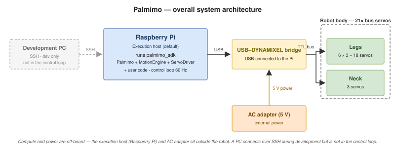
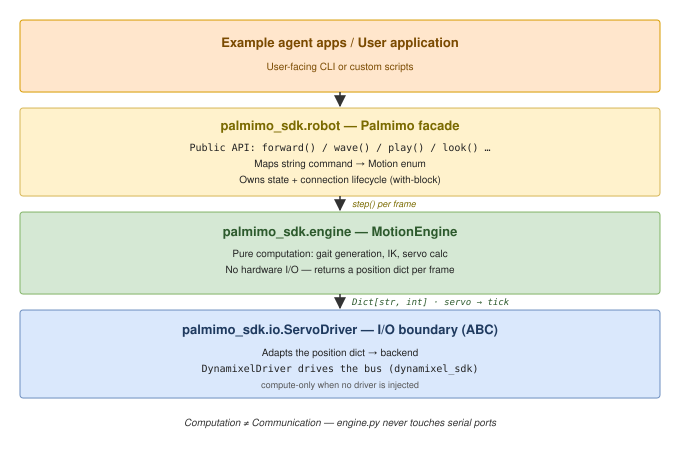
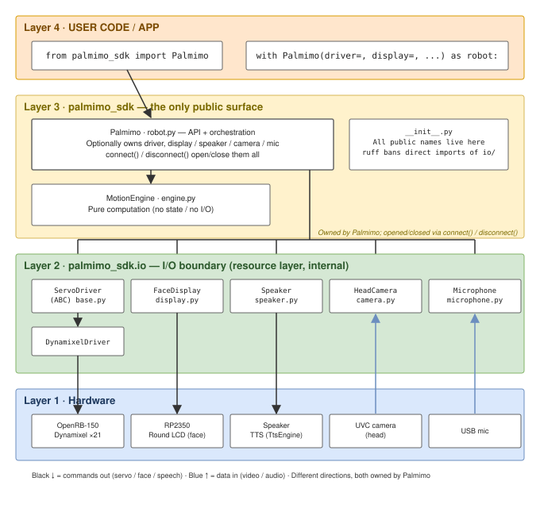

# System Architecture

This document describes the system architecture of "Palmimo DevKit," a desktop-sized
hexapod robot.

> This document covers the `palmimo_sdk` `robot.py` facade + `engine.py` computation
> layer + `ServoDriver` abstraction: the current structure and the design intent behind
> it (why this layering).

## Overall System Architecture

The overview is shown below.



Power is external and compute is a Raspberry Pi: the DevKit carries a
**Raspberry Pi 5 (16 GB)** as its control host, the servos run from a 5 V DC
adapter, and the Pi from its own USB PD supply — there is no onboard battery.
During development a PC can also act as the host (see below).

## Execution Model

The execution host is assumed to be a Raspberry Pi by default. The control loop (gait
generation → servo writes, 60 Hz) runs entirely on the Pi, which connects directly to
the OpenRB-150 (USB–DYNAMIXEL bridge) over USB serial. Because servo round trips never
cross a network, the loop is unaffected by network latency or jitter. During
development, a PC connects over SSH etc., but is not involved in control.

| Layer | Component | Role |
|---|---|---|
| Development machine | PC (SSH, etc.) | Editing, launching, log viewing. Not involved in control |
| Execution host | Raspberry Pi (default assumption) | Runs `palmimo_sdk` (`Palmimo` + `MotionEngine` + `ServoDriver`) and user code |
| Interface board | OpenRB-150 | USB-connected to the Pi. Ships pre-flashed as a USB–DYNAMIXEL bridge, relaying servo commands onto the bus |
| Actuators | 21× serial-bus smart servos | 18 leg + 3 neck. Protocol 2.0 / baud 1,000,000 |

## Software Architecture



### Data Flow

1. User calls `robot.forward()` -> sets Motion enum
2. Each `robot.step()` call -> MotionEngine computes servo positions
3. Returns `Dict[str, int]` (servo_name -> tick_value)
4. ServoDriver sends positions to the bus (compute-only when no driver is injected)
5. Repeat at target fps (default 60)

### Key Design Principles

- **Computation != Communication**: engine.py never touches serial ports
- **Neutral Contract**: Every motion starts and ends at neutral stance — raw
  servo neutral (2048) on every joint except the neck pitch, which settles at
  the engine's rest-trimmed center (see `neck_rest_pitch_deg` tuning in
  [api-reference.md](../reference/api-reference.md))
- **Frame-based**: Each step() produces one frame of servo positions
- **Deterministic**: Same motion + same phase = same output (testable without hardware)
- **Lean core**: `pyserial` is the SDK's only base dependency; every heavier import
  stays behind an extra, so `import palmimo_sdk` needs nothing beyond `pyserial`.
  TTS synthesis is pluggable (`TtsEngine`, default
  `PiperEngine` over `piper-plus`) and lives in `palmimo_sdk.io.tts` behind the
  `speech` extra; `palmimo_sdk.io.speaker.Speaker` itself is engine-agnostic and
  only owns queueing/playback. Shared mic capture, GTCRN denoise, and DTLN-AEC echo
  cancellation (`palmimo_sdk.audio`) live behind the `voice` extra. Any further voice-command
  processing (VAD / KWS / ASR) is the caller's responsibility, built on top of these —
  see the `examples/agents/wakeword` app for a concrete instance
- **`palmimo_sdk.io` owns I/O resources**: every hardware boundary is consolidated
  under `io/` — servos are `ServoDriver` / `DynamixelDriver`, camera capture is
  `HeadCamera`, and mic/speaker/display are `Microphone` / `MicStream` / `Speaker` /
  `FaceDisplay`. Upper layers only *consume*
  these; they never open a backend themselves. `palmimo_sdk.io` is an internal layer —
  consumers import from the `palmimo_sdk` root (direct reach-in is blocked by ruff
  TID251). Heavy backends (`dynamixel_sdk` / `cv2` / `piper` / `pyserial` /
  `sounddevice`) are imported lazily, so importing the module itself stays
  hardware-independent. This avoids duplicating the same capture logic across
  consumers (vision *processing* lives in the app, *capture* lives in the SDK).
  `MicStream` is the resource that shares one physical mic across several consumers
  (an always-on VAD, on-demand ASR capture, a denoiser, ...): it opens a single
  `sounddevice.InputStream` on a background thread and fans each chunk out to every
  `subscribe()`d consumer. That a `Microphone` and a `MicStream` point at the same
  physical mic is expressed only by the *convention* of giving both the same
  `device_key` string (there is no mechanism that matches device identities)
- **`palmimo_sdk.audio` is a pure processing layer**: where `io` owns hardware and
  returns raw bytes/arrays, `audio` only transforms sample streams and holds no I/O —
  the same separation as `engine.py` holding no servo I/O. GTCRN noise removal
  (`SpeechDenoiser` / `StreamingDenoiser`, in `denoise.py`) and DTLN-AEC acoustic
  echo cancellation (`DtlnResidual` / `GatedDtlnCanceller`, in `dtln.py`) both live
  here, lazily importing `sherpa_onnx` / `ai-edge-litert` / `numpy`. `AudioProcessor`
  (a WAV-bytes-in/mono-WAV-bytes-out `Protocol`) is the DI seam `MicStream` /
  `Microphone` route captured audio through, and any number of processors can be
  cascaded — only the first may require more than one input channel (its
  `capture_channels` convention). `Denoiser` wraps `StreamingDenoiser` behind that
  contract; `EchoCanceller` (in `aec.py`) wraps `GatedDtlnCanceller` the same way,
  consuming a multi-channel WAV (microphone + loudspeaker reference) and producing
  mono. `MicStream` defaults to `processors=[EchoCanceller()]` (`[]` for raw audio)
- **The facade bundles peripherals**: peripherals are owned symmetrically with the
  driver by the facade, as `Palmimo(display=..., speaker=..., camera=..., mic=...)`;
  `connect()` / `disconnect()` open and close them together with the servo bus —
  `connect()` also auto-wakes a connected driver, and `disconnect()` parks it (neutral
  return + neck soft-release) before closing. Every
  peripheral is optional — with no device present, `set_expression()` / `say()` become
  no-ops returning `None` (upper layers never need to know whether the physical layer
  exists). If one peripheral fails to open after another has already opened, the ones
  already open are closed before the error is re-raised, so a partial failure never
  leaves a port open. Unlike `set_expression()` / `say()`, `HeadCamera` / `Microphone`
  don't get a read method added on the facade — since a single physical device can have
  multiple readers (for a camera: VLM observe / wave watch), consumers read/record
  directly via `robot.camera` / `robot.mic` (the same shape as
  `robot.driver.write_positions`)

### Peripheral Ownership



`Palmimo` optionally owns the driver plus `FaceDisplay` / `Speaker` / `HeadCamera` /
`Microphone`, and `connect()` / `disconnect()` open and close them together. Data flows
in two directions — servo / face / speech *send* commands, camera / mic *ingest* data —
but **direction does not decide ownership**. `Palmimo` owns all of them regardless.

`Microphone` is used by apps whose interaction completes within a single recording.
The SDK also ships `MicStream` (shared streaming capture) and `palmimo_sdk.audio`
(GTCRN noise removal, DTLN-AEC echo cancellation), so raw chunk capture, denoising,
and echo cancellation can all ride on the SDK. VAD / KWS / ASR themselves remain the caller's
responsibility — the SDK stops short of them. An app that runs its own streaming
VAD + ASR stack and doesn't use the SDK's mic simply keeps `mic=None` — the facade
"can own it, but doesn't force it." This is exactly the same treatment as every
other peripheral; mic is not a special case.

### Package Structure

A uv-managed workspace. `palmimo_sdk` is the core; every other package consumes it
through the `Palmimo` facade. The dependency only ever runs that way — the core
never imports a package built on top of it:

```
pyproject.toml                          # uv workspace root
packages/
  palmimo_sdk/                             # Core SDK — the single user-facing window
    palmimo_sdk/
      __init__.py                       # Re-exports Palmimo / Motion / RoutineStep / MotionEngine / ServoDriver / DynamixelDriver / kinematics / palmimo_motor_ids / SUPPORTED_MOTOR_MODELS
      robot.py                          # Palmimo facade — public API + connection lifecycle
      engine.py                         # MotionEngine — pure gait/IK computation, no I/O
      kinematics.py                     # Shared IK/FK (leg_ik / servo ticks / body-frame foot position)
      io/__init__.py                    # Re-exports ServoDriver / DynamixelDriver / HeadCamera / Microphone / MicStream / Speaker / FaceDisplay / find_servo_port
      io/base.py                        # ServoDriver ABC (I/O boundary) + ServoTelemetry
      io/dynamixel.py                   # DynamixelDriver — concrete ServoDriver over the Dynamixel bus (+ find_servo_port auto-detection)
      io/camera.py                      # HeadCamera — head-camera capture resource (full-FOV MJPG -> downscale -> rotate)
      io/microphone.py                  # Microphone — USB mic capture (arecord/rec → WAV bytes)
      io/mic_stream.py                  # MicStream — shared streaming mic capture (background thread, fan-out to subscribers)
      io/_mic_registry.py               # Process-local device_key registry coordinating Microphone <-> MicStream ownership
      io/speaker.py                     # Speaker — non-blocking TTS orchestration (queue/worker/barge-in), delegates synthesis to a TtsEngine
      io/tts/base.py                    # TtsEngine ABC / TtsVoice protocol — the synthesis-engine boundary
      io/tts/piper.py                   # PiperEngine — the default TtsEngine, over piper-plus (MIT)
      io/display.py                     # FaceDisplay — host-side client for the RP2350 face display (USB-CDC)
      audio/denoise.py                  # SpeechDenoiser / StreamingDenoiser — GTCRN (sherpa-onnx) noise removal, pure sample transforms
      audio/dtln.py                     # DtlnResidual / GatedDtlnCanceller — DTLN-AEC (ai-edge-litert) echo cancellation, pure sample transforms
      audio/aec.py                      # EchoCanceller — AudioProcessor implementation wrapping GatedDtlnCanceller
      audio/processor.py                # AudioProcessor protocol (WAV in/out, DI/cascade) + Denoiser/ClipDenoiser + int16_to_wav/wav_to_int16/wav_to_int16_multi
    tests/                              # engine / robot / driver / kinematics tests
examples/
  agents/
    wakeword/                              # Wake-word voice agent example (Silero VAD + Whisper STT + LLM tool-calling)
    companion/                             # Always-on companion agent example (idle loop + speech/vision-driven responses, LLM tool-calling)
    openclaw/                              # Connection kit for driving Palmimo from OpenClaw (self-hosted AI assistant) over the MCP server
scripts/                                # Supported user diagnostics (diagnose_servos: scan / power / errors / joints / recover / oscillate)
```

### Dependencies

- `pyserial>=3.5` — the SDK's only base dependency (serial port communication)
- Everything else lives behind an extra in
  [`packages/palmimo_sdk/pyproject.toml`](../../packages/palmimo_sdk/pyproject.toml):
  `hardware` (`dynamixel-sdk`, the servo communication protocol, via `DynamixelBus`),
  `face` (`pyserial`, for `FaceDisplay`), `speech` (`piper-plus` TTS), `voice`
  (mic streaming plus denoise/AEC — `sounddevice`, `numpy`, `sherpa-onnx`,
  `ai-edge-litert`), `agent` (`pydantic`, the LLM tool-calling layer), `vision`
  (`opencv-python`, for `HeadCamera`), and `mcp` (`mcp`, `mcp-types`, `starlette`,
  `uvicorn`, plus `agent`)
- `tqdm>=4.66.0` — a dependency of this repository's own `scripts/`, not of the
  SDK package

## Design Intent (Why This Layering)

1. **Hardware-independent SDK entry point** — reaching for a motor library directly
   couples callers to internal implementation. `palmimo_sdk` is the single window, so
   users only need to know the `Palmimo` facade
2. **Separating motion computation from I/O** — gait generation, IK, and other motion
   computation is confined to `MotionEngine`, which only passes computed results (servo
   positions) to the Driver. The computation layer is testable without hardware
3. **Driver abstraction** — I/O is encapsulated behind the `ServoDriver` ABC, in
   preparation for future backends
4. **Lean core** — heavy optional dependencies (voice / tts) stay behind extras.
   `import palmimo_sdk` costs one base dependency (`pyserial`), and app-level processing
   built on top of them lives in the `examples/` apps (this is also a premise of
   distributing it as an OSS library)

As shown in the software architecture diagram above, the entry-point class `Palmimo`
delegates motion computation to `MotionEngine`, and I/O is encapsulated behind `ServoDriver`.
The backbone policy is to **keep computation (gait / IK) and communication (serial) in
separate layers**.

- **`robot.py` (`Palmimo`) = state and orchestration** — holds the user-facing API and
  the connection lifecycle (`with`-block control): `connect()` opens resources and, with
  a connected driver, auto-runs the `wake()` glide (limp -> neutral) unless built with
  `auto_wake=False`; `disconnect()` parks the robot first (return-to-neutral, then a
  neck soft-release ramp) before closing. `__exit__` delegates to `disconnect()` — a
  clean exit parks fully, but after an exception only the neck soft-release runs (motion
  commands are skipped so they can't mask the error / act on a possibly-bad state).
  Computation is delegated to `MotionEngine`, I/O to `ServoDriver`
- **`engine.py` (`MotionEngine`) = pure computation** — computes and returns servo
  positions from commands/frames only. Holds no state and does no I/O (testable without
  hardware)
- **`io/` (`ServoDriver` + concrete drivers) = the I/O boundary** — streams computed
  servo positions to the backend. `dynamixel_sdk` (`DynamixelBus`) is imported lazily
  via an optional extra (`palmimo-sdk[hardware]`), so the core stays
  hardware-independent

Separating motion selection (`forward()`, etc.) from execution (`run(seconds=)` /
`run(steps=)`) lets you specify "how many seconds / how many steps" without counting
control frames yourself, and the control rate (`fps`) is centralized in `Palmimo`.

`run()` is also the one place a caller running on another thread can interrupt the
robot: `Palmimo.cancel()` increments an internal counter under a small lock and is
documented as the single facade method safe to call cross-thread (it touches no other
state, so it cannot race the motion loop's own reads/writes). Each paced public method
(`run()` / `perform_dance()` / `play_realtime()`) snapshots that counter the instant it
is entered, and `_pace()` — the shared pacing loop all three use — compares the live
counter against that snapshot once per frame, raising `MotionCancelled` there if it
increased, unwinding the blocking call within roughly one frame period instead of only
once it finishes on its own. `perform_dance()`'s own non-paced end-hold and glide-home
sections poll the same counter on a short interval, and guarantee `stop()` (IDLE) runs
before a cancellation propagates out of it. Taking the snapshot at entry (rather than
clearing a `threading.Event` at the pacing loop's own start, the earlier design) means a
stray `cancel()` delivered while idle never carries over into the next call, without the
clear()/set() race a clearable `Event` has at that same entry point.

A caller that DISPATCHES a paced call onto another thread (rather than calling it
inline) has one more window to close: a `cancel()` landing after dispatch but before
the worker thread has actually reached its paced method's own entry would otherwise be
absorbed by that method's entry snapshot. `Palmimo._arm_cancel_scope()` /
`_disarm_cancel_scope()` close this structurally — arm records the live counter as the
armed baseline right before dispatch, and whichever paced method the worker reaches
first consumes it (via `_take_cancel_snapshot()`) as ITS OWN entry snapshot instead of a
fresh read of the counter, so a `cancel()` delivered anywhere from arming onward is
guaranteed to raise `MotionCancelled`. `AgentToolSet.call()` arms before handing a
tool's `execute()` to its worker thread and disarms in a `finally` once that worker
finishes, closing the window end-to-end for anything going through the agent toolset.

## Safety Design

This section makes the Hardware Safety section of [AGENTS.md](../../AGENTS.md) concrete
from the SDK design perspective. The guiding principle is to fail safe even if control
stops or an SSH session drops.

- **Safe servo range** — strictly enforce 200–3900 ticks, staying away from the
  mechanical limits (0 / 4095) (clamped in `io/dynamixel.py`)
- **Neutral stance at startup** — connection and script startup always begin smoothly
  from the neutral stance; abrupt jumps are prohibited
- **Servo telemetry** — `ServoDriver.read_telemetry()` reads present current, input
  voltage and temperature in a single bus sweep (`io/base.py`, implemented over a span
  read in `io/_dynamixel_bus.py`). One sweep rather than one read per signal is what
  lets a guard sample inside the control loop's frame budget. A motor that does not
  answer is reported as unread, never as a zero — an invented reading would be taken
  for evidence of health. Readings are surfaced; nothing acts on them
- **Stopping a motion, not cutting torque** — when a guard does act, the intended
  response is to end the motion (`motion → IDLE`) and leave torque on. Cutting torque
  on a servo makes that joint go limp, and a limp joint on a standing robot drops it —
  worse than the fault being guarded against. The servo's own firmware remains the
  breaker of last resort
- **Temperature is reported, not acted on** — a servo that is already hot does
  not cool at the speed a guard could react, so ending the motion buys little; and
  over an eight-hour exhibition day these servos measured around 50 °C, well inside
  their rating. The reading is surfaced and the decision to stop is left to the
  operator, who can see the room and the schedule; nothing acts on it
- **Losing control is a different case from guarding against a reading** — when the
  bus disconnects, status packets go wrong, or the loop stalls, there is no motion
  left to end, and the fallback is torque-off (limp) or a safe hold depending on
  whether the robot is bearing load. That is not in tension with leaving torque on
  above: a guard acts while control still works, this is what happens when it does not

## I/O Runtime Environment Requirements

`palmimo_sdk`'s core is hardware-independent, but the execution host that drives real
I/O is assumed to be a Raspberry Pi by default, with the following prerequisites.

- **OS** — 64-bit Linux (aarch64, e.g. Raspberry Pi OS). `uv` and the `dynamixel_sdk`
  dependency must resolve
- **Runtime** — `uv` ([software setup](../guides/installation.md) must succeed)
- **Serial permissions** — the execution user belongs to the `dialout` group
- **Device naming** — a stable OpenRB-150 port name via `udev` (fixed so the number
  doesn't change across USB unplug/replug)
