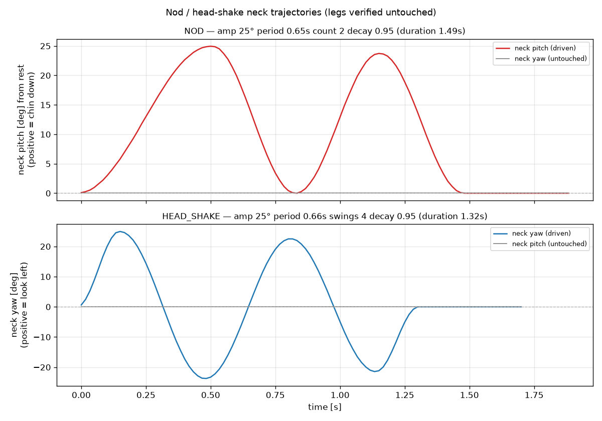

# API Reference — Palmimo

## Import

```python
from palmimo_sdk import Palmimo

robot = Palmimo()
```

## Motion Commands

| Method | Motion Enum | String Aliases |
|--------|-------------|----------------|
| `robot.forward()` | FORWARD | "forward" |
| `robot.backward()` | BACKWARD | "backward" |
| `robot.strafe_left()` | STRAFE_LEFT | "strafe_left" |
| `robot.strafe_right()` | STRAFE_RIGHT | "strafe_right" |
| `robot.rotate_left()` | ROTATE_LEFT | "rotate_left" |
| `robot.rotate_right()` | ROTATE_RIGHT | "rotate_right" |
| `robot.creep()` | CREEP | "creep" |
| `robot.dance()` | DANCE | "dance" |
| `robot.body_tilt()` | BODY_TILT | "body_tilt", "tilt" |
| `robot.pushup()` | PUSHUP | "pushup", "push_up" |
| `robot.wave()` | WAVE | "wave" (right leg), "wave_right" (FR), "wave_left" (FL) |
| `robot.nod()` | NOD | "nod" |
| `robot.head_shake()` | HEAD_SHAKE | "head_shake", "shake_head" |
| `robot.wave_both()` | WAVE_BOTH | "wave_both" |
| `robot.clap()` | CLAP | "clap" |
| `robot.bow()` | BOW | "bow" |
| `robot.stretch()` | STRETCH | "stretch" |
| `robot.stop()` | IDLE | "idle", "stop" |

See the [motion list](motions.md#available-motions) for what
each motion does. The notes below cover only behavior relevant at the API
level.

`wave` / `wave_right` and `wave_left` pick the front-right or front-left leg
— so does the choreography `play([("wave_left", s)])` form. Plays its tuned
choreography once and holds neutral after.

`nod` / `head_shake` are neck-only one-shots: the first stroke starts on the
very first frame (no wind-up, so they can be fired together with a face
expression), and a head that was looking away when the gesture fires is
blended back to center over the first 0.2 s instead of snapping. Both play
once and hold center after; see "Nod / Head-Shake Gesture Tuning" for the
knobs.

`wave_both` / `clap` both first settle into the "beg" stance, which keeps the
mid+rear support quad's front edge ahead of the center of gravity while the
front legs are airborne. Each plays once and holds neutral after.

`bow` / `stretch` are slow posture one-shots: re-selecting the motion after
it finishes replays it from the top; re-selecting it mid-gesture is ignored
(no snap under load). Switching away mid-gesture (e.g. `stop()`) recenters
the neck along with the legs, and once a gesture has finished, `look()` owns
the neck again. While a stretch is active the facade applies a quicker leg
profile (Profile_Velocity 120) and restores the driver's configured default
on exit, mirroring the wave's automatic per-axis tuning. Tuning knobs
(`bow_depth`, `bow_hold_s`, `stretch_fold_deg`, …) live on the engine —
`robot.engine.bow_depth = 26.0` — with deliberately shallow, tip-safe
defaults; see the `_BOW_*` / `_STRETCH_*` ClassVars in `engine.py`.
`stretch_fold_deg` in particular should be raised gradually on the real
robot: the fold drives the knee past the IK model's nominal range, whose
physical limit is not modeled.

`dance()` is the continuous body sway (run it with `step()` / `run()`) — the
default in the demo app (runs until stopped, like every motion). For a
finished one-shot performance — sway a few times, hold, then glide home —
use `perform_dance()` (see "Dance Tuning"); the demo plays this with
`--dance-oneshot`.

## Core Methods

### `robot.step() -> Dict[str, int]`
Advance one frame. Returns servo positions as `{name: tick_value}`.

### `robot.step_n(n: int) -> list[Dict[str, int]]`
Advance N frames. Returns list of position dicts.

### `robot.set_motion(name: str) -> None`
Set motion by string name (uses `_MOTION_MAP` lookup).

### `robot.run(*, seconds: float | None = None, steps: int | None = None) -> Dict[str, int]`
Run the current motion for a fixed duration, blocking and real-time paced at
the facade's `fps`. Pass exactly one of `seconds` (converted to
`round(seconds * fps)` cycles) or `steps`; both must be non-negative. Each
cycle streams to the driver and fires `on_step`, exactly like `step()`.
Returns the final servo positions (the current pose if zero cycles ran). For
unpaced loops (simulation, tests, custom timing) use `step()` / `step_n()`
instead — they compute as fast as possible.

```python
robot.forward()
robot.run(seconds=1.5)   # blocks ~1.5s, real-time paced
robot.stop()
```

Cancellable from another thread — see `robot.cancel()` below. `run()`
snapshots the cancel counter the instant it starts, before anything else
(so a `cancel()` delivered while idle never bleeds into the next call), then
checks the live counter against that snapshot once per frame inside the
shared pacing loop, raising `MotionCancelled` there if `cancel()` ran
meanwhile. `perform_dance()` and `play_realtime()` share that same pacing
loop and take their own snapshot the same way at their own entry, so a
`cancel()` interrupts them too — including `perform_dance()`'s non-paced
end-hold and glide-home sections, which poll the same counter on their own
short interval.

### `robot.cancel() -> None`
Signal an in-flight `run()` (or `perform_dance()` / `play_realtime()`) to
abort at the next frame boundary, raising `MotionCancelled` there.
`perform_dance()` and the agent tool layer's motion tools glide the legs
onto a stance pose (a short IDLE stream) before the `MotionCancelled`
propagates, so a cancelled gait doesn't leave one tripod frozen mid-stride,
bent and loaded, while the caller decides its next move.

**The one `Palmimo` method safe to call from a thread other than the one
driving the robot** (the thread inside `run()`/`step()`). Every other method
assumes a single caller thread; `cancel()` is the exception because it only
increments an internal counter under a small lock and touches no other
facade state, so it cannot race with the motion loop's own reads/writes.

Implemented as a monotonically increasing counter, not a `threading.Event`
that gets `clear()`ed: each paced public method (`run()` / `perform_dance()`
/ `play_realtime()`) snapshots the counter the moment it is entered, and
every frame boundary from then on compares the LIVE counter against that
snapshot — an increase means `cancel()` ran after entry. This closes a race
an `Event`-based design has: clearing the flag at the pacing loop's own
entry (to stop a stale cancel bleeding into the next call) can itself race a
concurrent `set()` from another thread and silently lose it. The counter has
no `clear()` step to race against, so a `cancel()` delivered anywhere between
a paced method's entry and its return is guaranteed to raise
`MotionCancelled` inside that call.

The one window this still leaves is on the CALLER's side, strictly before
the paced method has even been entered (e.g. dispatching a `run()` on a
worker thread and calling `cancel()` from another thread before the worker
actually starts running it) — a caller racing cancellation that way should
treat its own `cancel()` request as the authoritative outcome for reporting
purposes, rather than relying on `MotionCancelled` having been raised.

```python
import threading

robot = Palmimo()
robot.forward()
t = threading.Thread(target=lambda: robot.run(seconds=10))
t.start()
...
robot.cancel()          # from the main thread (or any other)
t.join()                 # the worker thread's run() raised MotionCancelled
```

A caller that wants the robot to land back in a stance after being cancelled
catches `MotionCancelled` around `run()` and calls `robot.stop()` in a
`finally` — exactly the pattern `palmimo_sdk.agent.tools._run_motion` already
uses for any other mid-motion failure, so no special handling is needed there.
`perform_dance()` guarantees this itself: whichever section a cancellation
lands in (the sway, the end-hold, or the glide home), `stop()` (IDLE) runs
before `MotionCancelled` propagates, so the facade never stays parked in the
DANCE motion after being cancelled. `MotionCancelled` is exported from
`palmimo_sdk` (`from palmimo_sdk import MotionCancelled`).

### `robot.cancel_checkpoint() -> int`
Entry point for a hand-rolled control loop that paces its own `step()` /
`run(steps=1)` calls instead of a single `run(seconds=...)`. Call once at the
top of the loop; pass the returned value to `raise_if_cancelled()` on every
iteration so a `cancel()` delivered between iterations (not just inside a
`run()` call) is still caught. Follows the same armed-scope rule every paced
method's own entry does.

### `robot.raise_if_cancelled(checkpoint: int) -> None`
Raise `MotionCancelled` if `cancel()` ran since *checkpoint* (from
`cancel_checkpoint()`).

### `robot.look(pitch: float | NeckPitchDegrees | NeckPitchNormalized = 0.0, yaw: float | NeckYawDegrees | NeckYawNormalized = 0.0) -> None`
Control neck. Can be called during any leg motion. Positive pitch tips the chin
DOWN (verified on hardware 2026-07); for yaw, which sign turns which way is not
yet verified on hardware. Each axis accepts three forms, and pitch/yaw each have
their own dedicated value-object types (so passing a yaw value as `pitch=`
raises `TypeError` instead of being silently accepted):

- a plain `float`/`int` — normalized [-1, 1]; the historical contract, kept
  for backward compatibility. Out-of-range values are clamped by the engine,
  same as always.
- `NeckPitchNormalized(value)` / `NeckYawNormalized(value)` — same normalized
  [-1, 1] fraction of the neck's mechanical travel on that axis, explicit
  about intent. Self-validating: construction raises `ValueError` outside
  [-1, 1].
- `NeckPitchDegrees(value)` / `NeckYawDegrees(value)` — a real neck angle for
  that axis. Converted internally by dividing by the axis's actual mechanical
  travel (`MotionEngine.NECK_PITCH_TRAVEL_DEG` / `MotionEngine.NECK_YAW_TRAVEL_DEG`,
  ~26.4° today on both axes). Self-validating: construction raises `ValueError`
  past that travel — no facade-side clamping, since a value object can only
  exist in-range once built.

`NeckPitchDegrees` / `NeckYawDegrees` / `NeckPitchNormalized` / `NeckYawNormalized`
are exported from `palmimo_sdk` (`from palmimo_sdk import NeckPitchDegrees,
NeckYawDegrees, NeckPitchNormalized, NeckYawNormalized`). The conversion happens
entirely inside `Palmimo.look()`; `MotionEngine.set_neck()` still only ever
receives a normalized float.

### `robot.look_center() -> None`
Return neck to its front/rest position (the `neck_rest_pitch_deg` trimmed
center — see "Nod / Head-Shake Gesture Tuning").

### `robot.reset() -> None`
Reset all state to initial (idle, neutral position).

### `robot.wake(duration=1.5, start_gain=300) -> None`
Wake from limp: glide to neutral while ramping leg Position_P_Gain from
*start_gain* up to the default, so the robot softly firms up and rises instead
of snapping. The neck is held at full gain the whole time so the head can't drop.
Falls back to a plain glide if the driver can't ramp gain.

`connect()` already runs this automatically once every resource is open
(`auto_wake=True`, the `Palmimo(...)` default) — call `wake()` directly only for
a custom *duration* / *start_gain*, or to re-wake without a full reconnect.

### `robot.sleep(duration=1.5, end_gain=300) -> None`
The inverse of `wake()`: glide the legs to neutral while ramping their
Position_P_Gain *down* to *end_gain*, then soft-release the neck so the head
eases down. Defaults to where `wake()` starts, so the two meet — waking neither
jolts nor sags. *end_gain* must be in `(0, 900]`: at zero the legs have torque
but no holding force and fold under the body.

The robot ends **compliant, not dead** — torque stays on at *end_gain*, and the
mic and camera stay open, so a sleeping robot can still be spoken to. That is the
difference from `disconnect()`, which parks and closes everything.

Releases any active wave / neck-gesture tuning first (see below). The neck is
held where it is during the glide, and once the head has settled onto the top
plate its goal is rewritten to the pose it actually reached — leaving no stored
error for the next gain write to release as a jolt. The leg ramp starts from the
gain the legs are actually at, so a second `sleep()` does not raise them first.

Degrades rather than skipping the point: a driver that can't sense position
still gets the gain ramp and the neck release (only the glide needs feedback),
and one that can't ramp gain still gets the glide.

The motion API stays callable while asleep — a `forward()` issued to a sleeping
robot walks it at *end_gain* with a limp head. Several things re-raise the gain
besides `wake()`: a wave's tuning writes `Position_P_Gain` to **every** motor,
and `set_p_gain()` does the same. None of them jolt the head now that the neck
goal matches where it is, but the robot does silently stiffen. Wake it first.

### `robot.return_to_neutral(max_steps: int = 120, settle_ticks: int = 2, *, duration: float | None = None) -> None`
Ease all servos back to neutral. With *duration* (seconds), a single timed glide;
without it, advances control cycles (up to *max_steps*, a safety cap) until every
joint has settled within *settle_ticks* of its target. Releases any active wave
tuning first (see below).

### `robot.set_p_gain(value: int | None) -> None`
Set Position_P_Gain on all motors (`None` restores per-motor defaults captured at
connect). No-op compute-only or on drivers without gain control.

### `robot.read_p_gain() -> dict[str, int] | None`
Read live Position_P_Gain back from the servos, one entry per motor. `None` if no
driver is attached.

### `robot.set_iir(enabled: bool, alpha: float | None = None) -> None`
Enable/disable the command-side IIR low-pass on the goal stream. *alpha* in (0, 1]:
smaller = heavier smoothing. No-op compute-only or on unsupported drivers.

### `robot.perform_dance(*, sways=3, end_hold=0.2, settle=1.0) -> Dict[str, int]`
Play one finished dance performance, blocking and real-time paced (like `run`).
Sways the body *sways* half-cycles using the baked dance feel, softly holds the
final extreme for *end_hold* s, then glides back to neutral over *settle* s.
Returns the final positions. The continuous `dance()` motion is unchanged — this
is the self-terminating gesture (the dance analogue of the wave greeting). See
"Dance Tuning" for the finishing flourish and why it avoids overshoot / a hard stop.

### `robot.play(routine, fps: int | None = None) -> Generator`
Play a choreography sequence.
- routine: `list[tuple[str, float]]` — (motion_name, duration_seconds)
- fps: defaults to `None`, which falls back to the facade's own `fps` (the
  constructor's `fps=`, `60` by default) — not a hardcoded `60`, so a
  `Palmimo(fps=30)` routine plays at 30 unless overridden here
- Yields `Dict[str, int]` servo positions per frame
- Special: `"look_around"` sweeps the neck sinusoidally (not in `_MOTION_MAP`). The
  `(str, float)` tuple form leaves `motion` at its `Motion.IDLE` default, so the legs
  stop for the duration of the step. To sweep the neck while the legs keep walking,
  pass a `RoutineStep(motion=..., neck_sweep=True)` instead of the tuple.

**`play()` does no pacing.** It computes a frame whenever its consumer asks
for one, and every frame it yields has already been streamed to the driver
(it is built on `step()`). With a driver attached, `fps` therefore decides
only how far the motion advances per frame — not how fast the servos are
driven. Consuming the generator eagerly (`list(robot.play(routine))`, or a
`for` loop that waits for nothing itself) plays the routine at whatever rate
that loop achieves, which is several times real time on a Pi. Nothing fails
and nothing is clamped, because every position stays inside the safe tick
range and only the rate is wrong. Use `play_realtime()` whenever a driver is
attached; `play()` is for compute-only work (simulation, tests, custom
timing) and for consumers that pace themselves — the same split as `step()`
versus `run()`.

### `robot.play_realtime(routine, fps: int | None = None, callback=None) -> None`
Blocking version of `play()` with real-time timing enforcement — the one to
use with a driver attached. Each frame is scheduled against an absolute
deadline by the same pacing loop `run()` and `perform_dance()` use, so a
routine takes the wall-clock time its steps ask for.
- fps: same fallback to the facade's own `fps` as `play()`
- callback: `Optional[Callable[[dict[str, int]], None]]` — called with positions each frame

## Peripherals & Connection

`Palmimo` optionally owns the face display, the speaker, the head camera, and the
microphone alongside the servo driver, so the facade stays the single window
onto the robot:

```python
from palmimo_sdk import (
    DynamixelDriver, FaceDisplay, HeadCamera, MicStream, Palmimo,
    Microphone, MicrophoneConfig, Speaker, SpeakerConfig,
)

robot = Palmimo(
    driver=DynamixelDriver(),  # port=None → auto-detects the servo bus at connect
    display=FaceDisplay(),
    # device_name_hint addresses the card by id, so audio survives a USB
    # replug renumbering it; unset takes ALSA's default instead.
    speaker=Speaker(SpeakerConfig(lang="ja", device_name_hint="ReSpeaker")),
    camera=HeadCamera(),
    mic=Microphone(MicrophoneConfig(device_name_hint="ReSpeaker")),  # or MicStream(device_name_hint=...)
    # auto_wake=False,  # opt out of the connect-time wake glide (sim / calibration)
)
with robot:                        # enter: connect() (wakes the robot); exit: disconnect() (parks, then closes)
    robot.set_expression("happy")
    robot.say("こんにちは")
    robot.camera.read()            # (ok, frame) — reading stays with the caller
    robot.mic.record(5)            # WAV bytes — recording stays with the caller
```

`mic=` accepts either a one-shot `Microphone` (shells out per recording) or a
shared `MicStream` (owns one background-read capture, fanned out to
subscribers) — both expose the same `open()` / `close()` / `is_open` contract,
so `Palmimo` doesn't branch on which one it holds. See "MicStream" below for
when to reach for the streaming form.

Every peripheral is optional and each is keyword-only. A facade with any subset
of display / speaker / camera / mic but no `driver` is valid — a face, a voice,
eyes, and/or ears with no legs — and one with all five `None` is compute-only.
Unlike `display`/`speaker`, Palmimo does not add read/record methods of its own;
the camera and the mic are shared hardware resources (one physical device,
multiple readers — the same shape as the servo bus, which `step()` writes to
and `robot.driver.write_positions` also reaches directly), so consumers reach
them through the `camera` / `mic` properties.

### `robot.connect() -> Palmimo`
Open whichever resources are attached and return `self`. The display also plays
its boot-wake animation (mirroring a real startup); the speaker probes that its
TTS engine (`PiperEngine` by default) is available; the camera opens its
`cv2.VideoCapture`; the mic runs a short capture probe. Raises `RuntimeError`
when nothing is attached.

If a driver is attached and connected, `connect()` then runs the `wake()` glide
automatically (limp -> gain-ramped rise to neutral) unless the facade was built
with `Palmimo(..., auto_wake=False)` — pass that for an immediate connect with
no glide (sim, calibration, tests).

If a later resource — including the wake glide itself — fails, the ones
already opened are closed before the error is re-raised, so a partial failure
never leaks an open port. This rollback also covers a `KeyboardInterrupt`
(Ctrl+C) during the wake glide, not just an `Exception`: it soft-releases the
neck before closing the driver, same as any other rollback, so an interrupted
wake never leaves the head held at full gain with torque about to cut.

`DynamixelDriver.connect()` and `FaceDisplay.connect()` fail fast rather than
hanging on a machine with no robot attached: the whole connect sequence (port
detection, port/bus open, and for the Dynamixel bus the motor handshake and
arming) is bounded by a per-driver `connect_timeout` (10s / 5s defaults, wide
margin over the sub-second real-hardware case). Exceeding it raises
`DynamixelConnectTimeoutError` / `FaceDisplayConnectTimeoutError`, which
propagate through `robot.connect()`'s rollback like any other connect failure
(details below and in `palmimo_sdk.io._timeout`).

### `robot.disconnect(*, park=True) -> None`
Parks the robot, then closes the mic, closes the camera, closes the speaker,
returns the display to its neutral IDLE face and closes it, then closes the
driver. Idempotent and safe when idle. Peripheral teardown is best-effort.

Parking (skipped when idle): with `park=True` (the default), eases the legs to
neutral via `return_to_neutral()`; then, regardless of `park`, soft-releases
the neck via a dedicated 14-step neck gain-lowering schedule — this
prevents the head dropping when torque cuts. Pass `park=False` to skip only the
leg return (used by `__exit__` after an exception, where streaming more motion
commands could mask the error / be unsafe) — the neck soft-release still runs.

On a connected robot this makes `disconnect()` take ~2.5s+ (the 14-step neck
ramp alone; `park=True` adds the leg return on top — `return_to_neutral()`'s
uncapped-duration path settles onto neutral within `max_steps` control
cycles, 120 at the default, but that loop has no per-cycle sleep, so those
120 cycles run as fast as the bus accepts the writes rather than over a fixed
2s) — callers on a tight shutdown budget (signal handlers, service stop
timeouts) must allow for it, since a hard kill mid-ramp cuts torque at a low
gain. Ctrl+C does not shorten it: SIGINT is suppressed for the entire body of
`disconnect()` — the leg return, the neck ramp, every peripheral close, and
the driver disconnect that cuts torque — so no press, however many, aborts
any stage or rushes the head down; with the guard in place, a hung bus write
in that 120-cycle loop is no longer escapable with Ctrl+C either — only
SIGKILL stops it. With `park=True` (the default) the robot is therefore
uninterruptible for the leg return's duration plus the ~2.5s neck ramp, not
the ~2.5s alone; with `park=False` it is uninterruptible for the ~2.5s neck
ramp on its own. Presses after `disconnect()` returns behave normally.

### `robot.set_expression(name: str, hold_ms: int = 0) -> str | None`
Show a face expression. `name` is case-insensitive; firmware aliases resolve
on-device. `hold_ms > 0` auto-returns the face to IDLE after that many ms; `0`
(default) holds until the next expression. Returns the firmware reply line, or
`None` when no display is attached (a no-op).

### `robot.say(text: str, lang: str | None = None) -> SpeechHandle | None`
Speak `text` through the attached speaker (non-blocking). `lang` (`"en"` /
`"ja"`) overrides the speaker's default voice. Returns the `SpeechHandle`
for the queued utterance, or `None` when no speaker is attached (a no-op).

Speech happens on a resident background worker, so a failure cannot reach you
by raising. Join the handle and read its `error` to tell speech from silence:

```python
handle = robot.say("こんにちは")
if handle is not None:
    handle.join()
    if handle.error is not None:
        ...  # the TTS engine never spoke (missing model, wrong audio output, ...)
```

`Speaker` itself is engine-agnostic — synthesis is delegated to a `TtsEngine`
(`Speaker(config, engine=...)`, defaulting to `PiperEngine`, which wraps
piper-plus):

```python
from palmimo_sdk import PiperEngine, Speaker, SpeakerConfig

speaker = Speaker(SpeakerConfig(), engine=PiperEngine(length_scale=1.1, volume=0.8))
```

`TtsEngine`, `TtsVoice`, `PiperEngine`, and `OpenAiEngine` are exported from
`palmimo_sdk` itself (implemented in `palmimo_sdk.io.tts`); see `PiperEngine`'s
piper-plus-specific settings (voice models, `data_dir`, `length_scale`,
`volume`) there. `PiperEngine` downloads the voice `Speaker` opens with, at
`open()` and nowhere else, into `~/.cache/palmimo/models/piper/<voice>/` unless
`data_dir` names another root (one directory per voice inside it) — see
[First-Time Setup for Voice Output](../guides/installation.md#first-time-setup-for-voice-output).

`OpenAiEngine` synthesizes off the robot instead. It is an alternative voice,
not a faster one: on a Pi 5, piper takes 0.19 s per utterance against this
engine's 1.57 s (median of three Japanese sentences, three passes each), since
the round trip dominates. What it buys is how it sounds, plus `instructions`.
The costs are that latency, an API key, per-utterance billing, and a hard
network dependency — a robot that cannot reach the internet cannot speak with
this engine, where the local one only sounds worse. `Speaker` therefore keeps
`PiperEngine` as its default and this is opt-in.

```python
from palmimo_sdk import OpenAiEngine, Speaker, SpeakerConfig

speaker = Speaker(SpeakerConfig(), engine=OpenAiEngine(voice="coral", speed=1.1))
```

Needs `OPENAI_API_KEY` in the environment (`preflight()` checks it and nothing
else — it does not spend a request validating the key). There is no model to
download, so `load_voice()` is cheap and startup costs nothing. `instructions` steers
delivery in plain language and has no counterpart in the local engines;
`volume` scales the returned samples (the API has no gain parameter) and is the
one setting that needs numpy.

`robot.disconnect()` (and closing the speaker directly) truncates any speech
in progress or still queued instead of waiting for it -- disconnect must
stay prompt. `join()` a handle first if it needs to finish speaking before
disconnecting.

### `robot.stop_speech() -> None`
Stop any in-flight speech immediately (barge-in). Idempotent, and a no-op
when no speaker is attached (same shape as `say`) or nothing is speaking.
Unlike `cancel()` (motion only), this reaches speech directly — a
background utterance started by `say()` has no running tool for a plain
`cancel()` to interrupt.

## MicStream

`palmimo_sdk.io.MicStream` is a shared, background-owned microphone capture —
useful when several consumers (an always-on VAD, an on-demand ASR capture, a
denoiser, ...) need the same raw audio but a physical mic can only be opened
by one stream at a time. It opens the device once, reads it continuously on a
background thread, and fans each chunk out to every subscriber. Format
defaults to 16k / mono / int16; `sample_rate` can be changed, but the default
`processors` (an `EchoCanceller`) is fixed at 16k — a mismatch is rejected in
`open()` itself (see the `processors` row below), not silently on every
chunk. Chunks default to 512 samples (32 ms at 16k, matching Silero VAD v5's
window). Requires the `palmimo-sdk[voice]` extra (`sounddevice`,
lazy-imported at `open()`).

The default `processors` also means the first `open()` in a fresh environment
needs network access, to auto-download the DTLN-AEC model (see
`palmimo_sdk.audio.dtln.ensure_dtln_models` below). For offline operation,
either call `ensure_dtln_models()` once ahead of time (while online) so the
model is cached locally, or place the model files manually and pass their
directory via `processors=[EchoCanceller(model_dir=...)]`.

By default every chunk has the loudspeaker cancelled out before it reaches
subscribers — `open()` builds a fresh `EchoCanceller` (see "palmimo_sdk.audio"
below) unless you pass `processors` yourself:

```python
from palmimo_sdk import MicStream

stream = MicStream(device_key="respeaker")   # processors=[EchoCanceller()] by default
stream.open()
with stream.stream() as chunks:
    for clean_chunk in chunks:
        ...  # already echo-cancelled
```

`EchoCanceller` requires a capture device that exposes the loudspeaker
loopback as an extra channel (ReSpeaker-family XMOS arrays do this natively —
6 channels by default). On a device without enough channels, `open()` fails;
pass `processors=[Denoiser()]` (GTCRN noise-only, mono) or `processors=[]`
(raw) instead.

| Constructor arg | Default | Description |
|------------------|---------|-------------|
| `sample_rate` | 16000 | Capture rate in Hz |
| `blocksize` | 512 | Samples per chunk read from the device |
| `device_name_hint` | `None` | Case-insensitive substring match against input device names (e.g. `"ReSpeaker"`); `None` uses the default input device |
| `device_key` | `"default"` | Identity used to coordinate with a `Microphone` sharing the same physical mic (see below) |
| `input_stream_factory` | `None` | Test seam; `None` lazily builds a real `sounddevice.InputStream` |
| `processors` | `None` | Chain of `AudioProcessor` each chunk is cascaded through before dispatch (WAV in/out, in order). `None` means "echo-cancel by default" — a fresh `EchoCanceller` is built at `open()`. Pass `processors=[]` for raw, unprocessed audio. A processor that raises has its chunk discarded (logged), not dispatched unprocessed. `open()` rejects (before touching the device) any processor whose `sample_rate` attribute disagrees with this stream's own `sample_rate`, or whose `capture_channels` (see `AudioProcessor` below) is declared by anything but the first processor in the chain |

With `processors` in play, a dispatched chunk's length no longer matches
`blocksize` — a processor (e.g. `EchoCanceller` / `Denoiser`, which buffer
internally) may emit less than it was given, or nothing for a given read.
Silero VAD's "one chunk = one window" assumption only holds for
`processors=[]`.

| Method / property | Description |
|---|---|
| `stream.open()` | Open the mic and start the background capture thread; idempotent |
| `stream.close()` | Signal the capture thread to stop and wait (bounded); idempotent. The capture thread itself owns releasing the device (even across a slow/wedged stop) — see below |
| `stream.is_open` | `bool` |
| `stream.subscribe(maxsize=64) -> Subscription` | Register a new subscription that receives every future chunk (bounded, drop-oldest queue; `Subscription.dropped` counts losses). A reopened stream starts with zero subscribers — subscribe again after a `close()`/`open()` cycle |
| `stream.stream(maxsize=64) -> Subscription` | Sugar for `stream.subscribe(maxsize)` — yields chunks until `close()`. Returns the `Subscription` itself (still directly iterable and usable as a context manager), so `with stream.stream() as chunks: ...` unsubscribes automatically on exit |
| `stream.record(seconds) -> bytes \| None` | Capture `seconds` of audio via a temporary subscription; returns WAV bytes, or `None` on failure |

Every dispatched chunk is read-only (`chunk.flags.writeable is False`) — the
same array object is fanned out to every subscriber, so call `chunk.copy()`
first if you need to modify it in place.

Also usable as a context manager (`with MicStream(...) as stream:`).

**Stream ownership on close:** `close()` never touches the underlying device
handle itself — the background capture thread that opened it owns
stopping/closing it, in its own `finally`, however it exits. If `close()`'s
join times out (the thread is wedged in a blocking read, e.g. a yanked USB
mic), a warning is logged and subscribers are notified immediately, but the
device is still released — whenever that blocked read eventually returns or
raises, even long after `close()` gave up waiting.

**`device_key`:** `MicStream` and `Microphone` cooperate on one physical mic
by sharing the same `device_key` string — when a `MicStream` is open, a
same-keyed `Microphone.record()` delegates to it instead of shelling out
(the two can't both hold the device). This is a same-process convention, not
device-identity resolution: ALSA device strings and sounddevice device
names/indices can't be machine-matched against each other, so two different
keys are always treated as different mics even if they're the same hardware.

## palmimo_sdk.audio

`palmimo_sdk.audio` is the pure sample-processing layer next to `io`: `io`
owns hardware resources and hands back raw bytes / arrays, `audio` only
transforms those samples — no `sounddevice`, no shelling out, no device
handles. It wraps sherpa-onnx's GTCRN noise-removal model (>=1.13.0) and the
DTLN-AEC echo-cancellation model pair (via `ai-edge-litert`), both behind the
`palmimo-sdk[voice]` extra, lazy-imported at construction.

### AudioProcessor

`AudioProcessor` is a `Protocol` — the DI seam `MicStream` / `Microphone` push
captured audio through: `process(wav: bytes) -> bytes`, WAV bytes in, mono
16k/S16_LE WAV bytes out (the input may be multi-channel — see
`capture_channels` below — but the output is always mono). Implementations
may be stateful (buffer internally), so output may be shorter than input, or
empty (a valid 0-frame WAV) — treat it as "what went in eventually comes
out", not "N frames in, N frames out". Any number can be cascaded in order
(each one's output feeds the next).

| Name | Description |
|---|---|
| `AudioProcessor` | `Protocol`: `process(wav: bytes) -> bytes`. By convention (not part of the `Protocol` itself) an implementation may expose a read-only `sample_rate: int` attribute naming the rate it requires; `Denoiser`, `ClipDenoiser`, and `EchoCanceller` all do, and `MicStream.open()` checks it. Likewise, an implementation may expose a read-only `capture_channels: int` naming the number of interleaved channels it needs in its input WAV (absent means 1/mono); `EchoCanceller` is the only one that does. Only the *first* processor in a `processors` chain may declare `capture_channels > 1` — `MicStream.open()` checks this too |
| `EchoCanceller(model_dir=None, *, size=256, channels=6, near_channel=1, reference_channel=5, far_end_silence_db=-60.0, hangover_hops=8)` | `AudioProcessor` implementation wrapping DTLN-AEC (`palmimo_sdk.audio.dtln`) — cancels the loudspeaker out of a mic channel, given a reference channel from the same read. Resolves/downloads both DTLN-AEC models and builds the interpreters in `__init__` (fail-fast). Cancels the loudspeaker only — servo/motor noise has no reference channel and passes through untouched. Requires a capture device that exposes the loudspeaker loopback as an extra channel (ReSpeaker-family XMOS arrays do this natively); on a device without enough channels, `MicStream.open()` fails — use `Denoiser()` or `processors=[]` instead |
| `Denoiser(model_path=None, *, num_threads=1)` | `AudioProcessor` implementation wrapping `StreamingDenoiser` — for a **continuous stream** (`MicStream`). Resolves/downloads the GTCRN model and builds the streaming denoiser in `__init__` (fail-fast). Stateful and never flushed by its `AudioProcessor` callers: using it on a self-contained clip cuts off the tail and bleeds residue into the next clip — use `ClipDenoiser` for that instead |
| `ClipDenoiser(model_path=None, *, num_threads=1)` | `AudioProcessor` implementation wrapping the offline `SpeechDenoiser` — for a **complete, self-contained clip** (`Microphone`'s recordings). Each `process()` call denoises the whole WAV it's given in one stateless shot; no tail cut off, no residue between clips |
| `int16_to_wav(data, sample_rate, channels=1) -> bytes` | Encode an int16 ndarray as WAV bytes — shape `(frames,)` for mono, `(frames, channels)` for multi-channel |
| `wav_to_int16(wav) -> tuple[ndarray, sample_rate]` | Decode mono/16-bit WAV bytes; raises `ValueError` for stereo / non-16-bit input |
| `wav_to_int16_multi(wav) -> tuple[ndarray, sample_rate]` | Decode 16-bit WAV bytes of any channel count to a `(frames, channels)` ndarray |

`MicStream`'s default `processors=[EchoCanceller()]` is what gives you
echo-cancelled audio out of the box (see "MicStream" above); `Microphone`
defaults to `processors=()` (raw) and denoises only if you pass
`processors=[ClipDenoiser()]` explicitly (its public contract is to stay
dependency-free without the `voice` extra) — `ClipDenoiser`, not `Denoiser`:
`Microphone` calls `process()` once per complete recording, and `Denoiser`'s
streaming engine is never flushed there, so it would cut off the tail of
every recording. `EchoCanceller` is not offered to `Microphone` either — it
needs a stateful stream and a guaranteed reference channel that `Microphone`'s
clip-capture path doesn't provide.

### Low-level: SpeechDenoiser / StreamingDenoiser

| Name | Description |
|---|---|
| `SpeechDenoiser(model_path, *, sample_rate=16000, num_threads=1)` | Offline (batch) denoiser. `.denoise(samples_int16)` / `.denoise_wav(wav_bytes) -> bytes` — one-shot use over an already-captured clip |
| `StreamingDenoiser(model_path, *, sample_rate=16000, num_threads=1)` | Streaming denoiser for a continuous mic feed. `.process(chunk_int16)`, `.flush()`, `.stream(chunks) -> Iterator` |
| `ensure_denoise_model(path=None) -> str` | Resolve the GTCRN model path, auto-downloading it (sha256-verified) to `~/.cache/palmimo/models` (or `$XDG_CACHE_HOME/palmimo/models`) if missing |

`Denoiser` is the recommended way to plug GTCRN denoising into a `MicStream` /
`Microphone`; reach for `StreamingDenoiser` directly only when you need the
int16-chunk-level API instead of the `AudioProcessor` WAV contract — e.g.
sitting it directly on a raw (`processors=[]`) `MicStream`'s chunk feed:

```python
from palmimo_sdk import MicStream
from palmimo_sdk.audio import StreamingDenoiser, ensure_denoise_model

stream = MicStream(device_key="default", processors=[])  # raw; denoise manually below
stream.open()
denoiser = StreamingDenoiser(ensure_denoise_model())

# `stream.stream()` (MicStream.stream, the chunk source) feeds
# `denoiser.stream(...)` (StreamingDenoiser.stream, the chunk transform) —
# same method name, unrelated methods on unrelated classes.
with stream.stream() as chunks:
    for clean_chunk in denoiser.stream(chunks):
        ...  # feed clean_chunk to VAD / ASR
```

## Properties

| Property | Type | Description |
|----------|------|-------------|
| `robot.positions` | `Dict[str, int]` | Current servo positions |
| `robot.motion` | `str` | Current motion name as lowercase string |
| `robot.engine` | `MotionEngine` | Direct access to engine (advanced) |
| `robot.p_gain` | `int \| None` | Effective Position_P_Gain (set value, else default) |
| `robot.iir` | `tuple[bool, float] \| None` | IIR `(enabled, alpha)`; `None` if unsupported |
| `robot.fps` | `int` | Control rate in cycles per second |
| `robot.dt` | `float` | Seconds per control cycle (`1 / fps`) |
| `robot.driver` | `ServoDriver \| None` | Attached servo driver; `None` in compute-only mode |
| `robot.display` | `FaceDisplay \| None` | Attached face display; `None` when no face is wired |
| `robot.speaker` | `Speaker \| None` | Attached speaker; `None` when no voice is wired |
| `robot.camera` | `HeadCamera \| None` | Attached head camera; `None` when no camera is wired |
| `robot.mic` | `Microphone \| MicStream \| None` | Attached microphone (one-shot or streaming); `None` when no mic is wired |
| `robot.is_connected` | `bool` | Whether a driver is attached and currently connected |
| `robot.has_connectable_resource` | `bool` | Whether any of driver / display / speaker / camera / mic is attached (what `connect()` requires) |

## Kinematics Helpers

`palmimo_sdk.kinematics` is the shared source of truth for leg geometry. Public
helpers include `leg_ik()` and `leg_servo_ticks()` for inverse kinematics, plus
`leg_forward_kinematics(leg_id, ticks)` for converting one leg's three raw servo
positions into an absolute `(x, y, z)` foot position in the body frame. All
distances are millimetres; tick dictionaries use the standard `leg_<id>_*` keys.

The user-facing SDK does not depend on the plotting or tuning scripts. Those
scripts consume these helpers so their geometry cannot drift from the motion
engine.

## Wave Gesture Tuning

The wave ships with baked-in defaults that reproduce the tuned hardware feel — no
knobs needed. These properties override the choreography at runtime if desired;
all are settable on `robot`:

| Property | Default | Description |
|----------|---------|-------------|
| `wave_size` | 160 mm | Swing size above the rest height |
| `wave_speed` | 1.9 | Up/down stroke rate (>1 = snappier) |
| `wave_intro_speed` | 2.3 | Prep-raise + return rate |
| `wave_raise_speed` | 0.6 | Rate of just the first big up-stroke (slow, deliberate) |
| `wave_decay` | 0.8 | Per-wave amplitude multiplier — each wave 0.8x the last (1 = uniform) |
| `wave_count` | 2 | Number of up/down waves |
| `wave_period` | 1.0 s | Seconds per up-down cycle |
| `wave_dwell` | 0.6 | Hold fraction per half-cycle (0 = continuous wiggle) |

**Automatic per-axis servo tuning:** while a wave (or `wave_both` / `clap`) is
active, the facade applies a crisp arm treatment to the moving arm(s)
(Profile_Velocity 0 + IIR low-pass) and a higher Position_P_Gain, then restores
defaults when the gesture ends — so every caller gets the tuned feel without
managing servo registers. No-op on drivers without these RAM tweaks.

> The baked rates were dialed in on hardware, then scaled to compensate for the
> tuning bench's per-frame readback slowdown so production playback matches what
> was tuned. See `engine.py` `_WAVE_*` for the provenance.

## Nod / Head-Shake Gesture Tuning

Runtime knobs for the yes/no neck gestures, all settable on `robot` (defaults in
`engine.py` `_NOD_*` / `_SHAKE_*`). The two gestures keep near-equal stroke
periods so they stay tempo-matched as a reply pair. Defaults were tuned on
hardware with on-camera review (2026-07): gentle first descent, bold amplitude,
near-uniform stroke size.

| Property | Default | Description |
|----------|---------|-------------|
| `nod_amp_deg` | 25° | Depth of the first chin-down stroke |
| `nod_period` | 0.65 s | Seconds per down-up cycle |
| `nod_count` | 2 | Number of down-up cycles |
| `nod_decay` | 0.95 | Per-cycle amplitude multiplier (<1 = later dips shallower) |
| `nod_first_down_scale` | 1.6 | Duration multiplier of just the first descent (>1 = gentler opening; start latency is unchanged) |
| `shake_amp_deg` | 25° | Width of the first sideways swing |
| `shake_period` | 0.66 s | Seconds per full left-right-left cycle |
| `shake_swings` | 4 | Side peaks (4 = 2 round trips); odd values end half-way for a stronger "no-no" |
| `shake_decay` | 0.95 | Per-swing amplitude multiplier |
| `neck_rest_pitch_deg` | 15° | Resting pitch trim (positive raises the gaze; clamped to ±20°). Robot-wide: idle look targets and the gestures' home position all sit on this trimmed center |

Amplitudes are clamped to the neck's safe range (±300 ticks ≈ ±`MotionEngine.NECK_PITCH_TRAVEL_DEG`
/ `NECK_YAW_TRAVEL_DEG`, ~26.4°) regardless of the knob value, and the absolute pitch additionally never leaves the
servo-neutral band (the trim moves the working center, not the limits). The
exact play length for the current knobs is `engine.gesture_seconds(Motion.NOD)`
/ `engine.gesture_seconds(Motion.HEAD_SHAKE)` (≈1.5 s / ≈1.3 s at the defaults).
Firing a gesture mid-gait is safe: the legs glide back to the neutral stance
(the same easing as IDLE) while the head gestures.

> `neck_rest_pitch_deg` redefines what "front" means for the whole neck:
> `look()` / `look_center()` targets ride on the trimmed center, and
> `return_to_neutral` settles the neck pitch there rather than at the raw servo
> neutral (2048).

**Automatic servo tuning:** while a gesture is active the facade sets
Profile_Velocity 0 on the two driven neck axes so the ~200 ms strokes aren't
smeared by the default time-based profile (300 ≈ 300 ms per goal), then restores
the default when it ends. No-op on drivers without the RAM tweak.

Default-knob trajectories: 
## Two-Handed Gestures (`wave_both` / `clap`)

Both front legs lift at once, so only the mid+rear quad supports the robot. The
defaults sit in the analyzed stable zone; the knobs open them up (verify tip
margin and middle-leg servo heat on hardware before relying on a wider setting).

Shared beg-stance knobs (used by both gestures):

| Property | Default | Description |
|----------|---------|-------------|
| `wave_both_mid_forward` | 35 mm | Middle feet extra forward shift — carries the support quad's front edge ahead of the CoG. The main stability knob: raise it before raising anything else |
| `wave_both_lean` | 10 mm | Whole-body backward shift. Also folds the rear knees under load — keep small, prefer `mid_forward` for margin |
| `wave_both_noseup` | 8 mm | Rear corners drop — the nose-up "beg" look |
| `wave_both_intro_speed` | 2.3 | Prep/return rate for the two-hand gestures (the single wave keeps `wave_intro_speed`; the middle-feet drag held up fine at this clip on hardware). Rate knobs are floored at 0.2 — 0/negative would freeze/reverse the gesture |

`wave_both` only:

| Property | Default | Description |
|----------|---------|-------------|
| `wave_both_size` | 110 mm | Two-hand swing above the rest height (single wave: 160). Both arms pump the body pitch in phase — raise together with `mid_forward` |
| `wave_both_yaw` | 15 deg | Inward yaw on each raised arm (hands closer together). Clamped per frame so the hand separation never drops below 25 mm (unlike the clap, the wave must not make contact — unclamped, ~41°+ would collide the paddles). Also moves the arms' mass forward, eating tip margin — raise `mid_forward` with it |
| `wave_both_phase` | 0.5 | Arm offset in wave periods: 0.5 = alternation (the default look), 0 = both arms together (banzai). Alternation also cancels the arms' pitch reaction instead of doubling it |
| `wave_both_speed` | 2.6 | Stroke rate — own knob, so the two-hand tempo doesn't touch the single wave's 1.9 |
| `wave_both_decay` | 0.9 | Per-wave amplitude multiplier (single wave: 0.8) |

The stroke count/shape reuses the shared wave knobs (`wave_raise_speed`,
`wave_count`, `wave_period`, `wave_dwell`); defaults are the 2026-07-04
hardware tuning (alternate, 2 waves per arm, quick strokes, light decay).

`clap` only — open/close is specified as hand separation in mm (centre-to-centre
of the front feet), converted to arm yaw internally:

| Property | Default | Description |
|----------|---------|-------------|
| `clap_count` | 3 | Close/open strokes per gesture |
| `clap_period` | 0.2 s | Seconds per close+open (~5 Hz patter — the 2026-07-04 hardware tuning; the narrow `clap_open` is what lets this tempo track at full amplitude) |
| `clap_gap` | 20 mm | Commanded closest foot-centre separation, = the engine floor. 20 is where the paddle faces just touch — **the light touch is the intended clap feel** (owner-tuned); the floor only prevents jamming them harder than that. At the shipped 5 Hz tempo the arm IIR rounds the actual approach to ~31 mm (measured); slow `clap_period` to ≤0.4 s to reach the commanded gap (and the light touch). Raise the gap if contact is undesired |
| `clap_open` | 90 mm | Separation between claps (small travel = fast tempo stays crisp) |
| `clap_height` | 90 mm | Hand lift above the neutral foot height (floored at 10 mm — the open/close sweep must not scrub the grounded feet) |
| `clap_dwell` | 0.0 | Fraction of each half-stroke held at the ends (0 = continuous patter) |
| `clap_decay` | 1.0 | Per-beat reopen multiplier. <1 makes each reopen shallower (the hands settle toward each other) — the "repetition wants decay" lever. Every beat still closes to `clap_gap`, so the contact floor is unaffected |
| `clap_intro_speed` | 1.2 | Prep/raise + lower/release rate — the clap's own knob (deliberately slower than `wave_both_intro_speed`'s 2.3: the slow raise before the fast patter is the approved contrast) |
## Dance Tuning

The dance ships with baked-in defaults that reproduce the tuned hardware feel — a
small snappy body roll on an arcing head, with a brief hold at each extreme. No
knobs needed; these properties override the sway at runtime if desired, all
settable on `robot`:

| Property | Default | Description |
|----------|---------|-------------|
| `dance_roll_deg` | 5° | Body roll amplitude |
| `dance_pivot_h` | 125 mm | Roll-pivot height; near head height keeps the head ~fixed in space |
| `dance_dwell` | 0.2 | Hold fraction at each sway extreme (0 = continuous sine) |
| `dance_speed` | 0.0149 | Dance tempo (its own knob — does NOT change the walk `gait_speed`) |
| `dance_level_head` | False | Arc head (dips at extremes); set True to lift the body for a flat sway |

**Finishing flourish (`perform_dance`):** the finished performance sways
`sways` (3) times, **ending on an extreme** (the held side, not a center
crossing), then closes with two stages tuned on hardware:

- **`end_hold` (afterglow, 0.2 s)** — the legs softly hold the *actual* final pose at a
  lowered Position_P_Gain. Holding the real pose (not the last full-amplitude
  goal the servos were lagging toward) avoids an overshoot past the sway just
  shown; the lowered gain keeps it soft instead of a hard clunk. The neck is left
  out of the hold so it stays commanded to neutral (head up) at full gain.
- **`settle` (slow return, 1.0 s)** — a single eased glide back to neutral (larger
  = slower/softer). Never an ease-out *during* the dance, which would read as
  extra sway.

> Defaults are hardware-tuned — see `engine.py` `_DANCE_*` (the sway) and
> `robot.py` `_DANCE_*` (the finish). `dance_speed` is fps-compensated: it is
> scaled by the readback-slowed framerate it was tuned at, so playback at the
> production 60 fps (`perform_dance`) holds the intended wall-clock speed
> instead of running faster.

## Port Auto-Detection

### `find_servo_port() -> str`
Auto-detect the servo bus's serial port (its USB-to-servo bridge) without specifying a hard-coded path.

```python
from palmimo_sdk import find_servo_port, PortDetectionError

try:
    port = find_servo_port()
except PortDetectionError as e:
    print(e)  # "Servo bus not found. Check connection or specify with --port."
```

Detection priority:
1. USB vendor-ID match (`0x2F5D`) — on Windows the bridge enumerates as a nameless generic serial device, so the VID is the only identifier.
2. Pattern fallback (only if step 1 finds nothing): `/dev/ttyACM<n>` (Linux) or `/dev/cu.usbmodem*` (macOS).

Returns the device path (e.g. `"/dev/ttyACM0"`) when exactly one candidate is found.
Raises `PortDetectionError` when zero or multiple candidates are found.

Calling it yourself is only needed to print or log the resolved path —
`DynamixelDriver(port=None)` (the default) runs the same detection at
`connect()` time, mirroring `FaceDisplay(port=None)`.

### `PortDetectionError`
Raised by `find_servo_port()` when detection fails. The message always
includes a remedy (specify `--port` explicitly).

```python
from palmimo_sdk import PortDetectionError
```

### `DynamixelConnectTimeoutError` / `FaceDisplayConnectTimeoutError`
Raised when the whole connect sequence exceeds `connect_timeout` seconds
(10s / 5s defaults; see `robot.connect()` above). Distinct from
`PortDetectionError` (auto-detection found zero or multiple candidates):
these fire when a port *was* resolved but opening/handshaking/arming never
completed — no robot/face attached, or the matched port is a different
device. The message names the device and the resolved port.
`FaceDisplayConnectTimeoutError` subclasses `FaceDisplayError`, so broad
catches keep working. If the abandoned connect attempt finishes late anyway,
the orphaned bus/port is closed automatically (`palmimo_sdk.io._timeout`).

```python
from palmimo_sdk import DynamixelDriver, DynamixelConnectTimeoutError

try:
    DynamixelDriver().connect()  # no robot attached
except DynamixelConnectTimeoutError as e:
    print(e)  # "Timed out connecting to the Dynamixel servo bus on ... "
```

## palmimo_sdk.agent typing

`palmimo_sdk` ships a `py.typed` marker (PEP 561), so its annotations reach
your type checker. The agent layer's receiver — `Tool.execute(robot)` and
`AgentToolSet(robot, ...)` — is typed as `palmimo_sdk.agent.PalmimoLike`, a
`Protocol` listing exactly the facade surface the tools use. A real `Palmimo`
satisfies it as-is; a hardware-free test double satisfies it structurally by
implementing just the members it exercises, no subclassing or casting needed.

## palmimo_sdk.mcp

Exposes a `Palmimo`'s agent tools (`palmimo_sdk.agent.AgentToolSet` /
`Tool` — see `palmimo_sdk/agent/tools.py` and `toolset.py` for the tool
catalog) over the [Model Context Protocol](https://modelcontextprotocol.io/),
so an MCP client
(Claude Code, Claude Desktop, or any other MCP-speaking agent) can list and
call them the same way an OpenAI tool-calling loop does. Requires the
`palmimo-sdk[mcp]` extra — see [the MCP server guide](../guides/mcp-server.md) for the
install command and CLI examples.

### `build_mcp_server(toolset: AgentToolSet, log_tool_calls: str = "summary") -> mcp.server.lowlevel.Server`
Builds a low-level MCP server that lists `toolset`'s registered tools
(`mcp_types.Tool.input_schema` mirrors each `Tool.parameters_schema()`) and
dispatches `tools/call` requests to `await toolset.call(name, arguments)`, via
the `on_list_tools`/`on_call_tool` handlers `Server` takes on the MCP Python
SDK 2.x. Building the server does not connect the robot or start serving —
see the CLI below.

```python
from palmimo_sdk import Palmimo
from palmimo_sdk.agent import AgentToolSet
from palmimo_sdk.mcp import build_mcp_server

robot = Palmimo()
server = build_mcp_server(AgentToolSet(robot))
```

`AgentToolSet.call(name, arguments)` is `async`: it serializes overlapping
callers with its own internal lock (`toolset.is_busy()` reports whether it is
currently held) and runs each tool's `execute()` — synchronous and
potentially blocking for seconds, e.g. a gesture's `run(seconds=...)` —
on a worker thread via `asyncio.to_thread`, so two concurrent MCP calls never
drive the single-threaded Palmimo facade at the same time while the event
loop stays free for other MCP protocol traffic. This server's `call_tool`
handler runs `toolset.call(...)` as its own `asyncio.Task` and awaits it
behind `asyncio.shield`, so a cancellation of the HANDLER's own task (a
client disconnect, the session shutting down, ...) cannot reach into
`toolset.call()` — it keeps running to completion regardless. It is
deliberately **non-preemptive** — it never calls
`toolset.cancel_running()`, so a motion already in flight always runs to
completion rather than being cut short by a second, concurrent request (see
`mcp/server.py`'s module docstring for the full rationale). A caller that
wants a genuinely preemptible tool-calling loop should drive `AgentToolSet`
directly (`await toolset.call(...)` / `await toolset.cancel_running()`)
instead of going through this MCP server.

A `ToolResult`'s `text` becomes a `TextContent`; each JPEG in `images` becomes
an `ImageContent` (base64, `image/jpeg`) after it. `toolset.call()` never
raises for an LLM-caused failure, so an unknown tool name or bad arguments
come back as ordinary `TextContent`, never an MCP protocol error.
`palmimo_sdk.robot.MotionCancelled` (raised when `Palmimo.cancel()`
interrupted an in-flight motion) is likewise reported as ordinary,
non-error `TextContent` (`"interrupted: ..."`) rather than an error — an
observation, not a failure.

Each dispatched call leaves one `INFO` record on the `palmimo_sdk.mcp.server`
logger: `tool call name=<tool> args={...} outcome=<ok|error|interrupted>
duration_ms=<float> result=<...> images=<n>`. `log_tool_calls` selects how much
of the call it carries — `"summary"` (the default) prints argument names and
numeric values but reduces every string to its length, `"full"` prints
argument values and the result text verbatim, and `"off"` emits nothing.
`build_mcp_server()` only emits: it installs no handler and changes no logger's
configuration, so the records go nowhere until the embedding application
configures one (the CLI below sends them to stderr). A library that attached a
stdout handler here would corrupt every stdio-transport session, since stdout
is the MCP protocol stream on that transport.

### CLI: `python -m palmimo_sdk.mcp`
Wires a real `Palmimo` (servo bus, face display, speaker, head camera — each
degrading to `None` on failure the same way `_build_servo_driver` does in the
wake-word example) to `build_mcp_server()` and serves it, over either stdio
(the default, for a local MCP client sharing this process's stdin/stdout) or
streamable HTTP (for a client on a different machine than the robot). See
[the MCP server guide](../guides/mcp-server.md) for the run commands, the full CLI flag
reference, and Claude Code registration commands.
