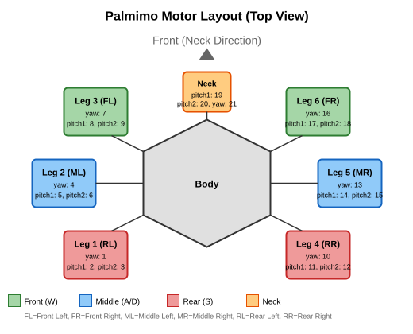

# Palmimo LeRobot Integration

LeRobot plugins for Palmimo, kept as a self-contained integration outside the
core SDK. This is a standalone [uv](https://docs.astral.sh/uv/) workspace that
depends on `palmimo_sdk` (the core, in [`../../packages/palmimo_sdk/`](../../packages/palmimo_sdk/)) via
a path dependency — the SDK never depends back on these plugins.

- `lerobot_robot_palmimo/` — robot (follower) plugin
- `lerobot_teleoperator_palmimo/` — WASD keyboard teleoperator

The plugins consume `palmimo_sdk` as their single window: gait/IK computation is
delegated to `MotionEngine`, and no hardware backend is opened directly. See
[Architecture & SDK design](../../doc/explanation/architecture.md).

## Setup

```bash
cd integrations/lerobot
uv sync                 # runtime deps (pulls palmimo_sdk from ../../packages/palmimo_sdk)
uv sync --group dev     # + ruff / mypy / pytest
```

## Structure

- `lerobot_robot_palmimo/` — robot (follower) plugin
  - `pyproject.toml`
  - `lerobot_robot_palmimo/`
    - `__init__.py`
    - `config_palmimo.py` — `PalmimoConfig`: configuration class
    - `palmimo.py` — `Palmimo`: robot implementation
    - `scripts/` — utility scripts
      - `ping_motors.py` — motor connectivity check
      - `reset_pose.py` — move to zero position
      - `off_torque.py` — torque off
- `lerobot_teleoperator_palmimo/` — WASD keyboard teleoperator
  - `pyproject.toml`
  - `lerobot_teleoperator_palmimo/`
    - `__init__.py`
    - `config_palmimo.py` — `PalmimoTeleopConfig`: configuration class
    - `palmimo.py` — `PalmimoTeleop`: WASD input implementation

## Usage

Palmimo has tripod-gait-based walking and motion capabilities. For what the gait is
and why, see [how Palmimo moves](../../doc/explanation/motion-system.md); for the
motions you can call, see the [motion list](../../doc/reference/motions.md).

Two prerequisites apply to every command below on Linux, including a Raspberry Pi
following the [Pi setup guide](../../doc/guides/raspberry-pi-setup.md): the serial port has to
be named explicitly, and the keyboard listener needs a display.

### Serial Port

`--robot.port` has no default that works. `PalmimoConfig.port` is `/dev/ttyUSB0`, and the
plugins do no port detection of their own — unlike the SDK, whose `find_servo_port()`
identifies the USB-to-servo bridge by VID and is what `scripts/diagnose_servos.py` uses
when `--port` is omitted. On Linux the bridge enumerates as a `/dev/ttyACM*` node, on
macOS as `/dev/cu.usbmodem*`.

The number is not stable: it shifts when USB devices are added or removed, and the face
display is a `ttyACM` node as well. Ask the SDK which node the bridge is on right now,
and pass that value:

```bash
uv run python -c "from palmimo_sdk import find_servo_port; print(find_servo_port())"
```

Re-check it whenever the USB devices change. A stale value fails quietly rather than
loudly — the plugin opens a port that answers nothing and the scan reports an empty
motor list (`Full found motor list (id: model_number): {}`).

### Display (Linux)

The teleoperator reads the keyboard through lerobot's `KeyboardTeleop`, which is
pynput-based: it opens no window of its own, but on Linux pynput still needs an X
display to listen on. Without one, `connect()` fails immediately:

```
DeviceNotConnectedError: Keyboard listener unavailable — pynput needs a display (Linux)
or Accessibility permission (macOS). Palmimo teleop needs an interactive session.
```

This does not mean the Desktop image or a logged-in desktop session. A virtual
framebuffer satisfies pynput, so the headless Raspberry Pi OS Lite install the Pi setup
guide produces needs only `xvfb`:

```bash
sudo apt-get install -y xvfb
Xvfb :99 -screen 0 1024x768x24 &
```

Point `DISPLAY` at it when launching, and the listener starts (`pynput is available -
enabling local keyboard listener.`).

Keys have to reach *that* display: pynput watches the X server named by `DISPLAY`, so
keystrokes typed into an SSH terminal never arrive. Drive a virtual display
programmatically — for example with `xdotool` against `DISPLAY=:99` — and use a real X
session when you want to hold keys by hand.

### Teleoperation

```bash
# Raspberry Pi OS Lite: virtual display, explicit port
DISPLAY=:99 uv run lerobot-teleoperate \
  --robot.type palmimo \
  --robot.port /dev/ttyACM0 \
  --teleop.type palmimo
```

On macOS neither prefix applies — pass the `/dev/cu.usbmodem*` path and grant the
terminal Accessibility permission instead.

**Controls (summary):**

- `W` / `S`: forward / backward (tripod gait)
- `A` / `D`: strafe left / right
- `Q` / `Z`: rotate counter-clockwise / clockwise
- `E`: dance
- `O` / `L`: neck pitch up / down
- `N` / `M`: neck yaw left / right
- `R`/`F`/`V`/`B`, `1`-`0`, `T`-`K`: IK calibration / debug poses — these write
  a leg pose directly, bypassing `MotionEngine`'s smoothing (`R/F/V/B` and
  `T/Y/U/I/G/H/J/K` step legs ±200 ticks from neutral in one frame); use them
  with the robot in the air
- `ESC`: quit

> This teleop path launches `PalmimoTeleop` from
> [lerobot_teleoperator_palmimo/lerobot_teleoperator_palmimo/palmimo.py](./lerobot_teleoperator_palmimo/lerobot_teleoperator_palmimo/palmimo.py).
> To drive walking from your own program, or to use the full IK-based `MotionEngine`, see
> [Controlling motions](../../doc/guides/controlling-motions.md).

### Recording a Dataset

`lerobot-record` drives the same robot and teleoperator, so the port and display
prerequisites above apply unchanged. One more flag is needed on a headless robot:
`play_sounds` defaults to `True`, and lerobot reads its events aloud through `spd-say`
from speech-dispatcher, which Raspberry Pi OS Lite does not ship. The recorder then dies
on the first announcement, leaving a dataset directory holding `meta/info.json` and no
frames:

```
INFO ls/utils.py:142 Recording episode 0
FileNotFoundError: [Errno 2] No such file or directory: 'spd-say'
```

Turn the announcements off:

```bash
DISPLAY=:99 uv run lerobot-record \
  --robot.type palmimo \
  --robot.port /dev/ttyACM0 \
  --teleop.type palmimo \
  --dataset.repo_id <user>/<dataset> \
  --dataset.single_task "walk forward" \
  --dataset.push_to_hub false \
  --play_sounds false
```

Installing `speech-dispatcher` works too, but a robot that is recorded over SSH has
nobody in front of it to hear the announcements, so dropping them is the smaller change
of the two.

### Motor Configuration

Palmimo uses 21 Dynamixel **XC330-M288-T** (default) or **XL330-M288-T** motors. For an
XL330 unit, pass `--motor-model xl330-m288` to each utility command, and
`--robot.motor_model xl330-m288` when launching via `lerobot-teleoperate`. Both models
conform to the X-Series Protocol 2.0 and share the same control table and resolution
(4096 ticks/rev).



| Location | Motor Names | ID |
|-----|----------|-----|
| Leg 1 | `leg_1_yaw`, `leg_1_pitch1`, `leg_1_pitch2` | 1, 2, 3 |
| Leg 2 | `leg_2_yaw`, `leg_2_pitch1`, `leg_2_pitch2` | 4, 5, 6 |
| Leg 3 | `leg_3_yaw`, `leg_3_pitch1`, `leg_3_pitch2` | 7, 8, 9 |
| Leg 4 | `leg_4_yaw`, `leg_4_pitch1`, `leg_4_pitch2` | 10, 11, 12 |
| Leg 5 | `leg_5_yaw`, `leg_5_pitch1`, `leg_5_pitch2` | 13, 14, 15 |
| Leg 6 | `leg_6_yaw`, `leg_6_pitch1`, `leg_6_pitch2` | 16, 17, 18 |
| Neck | `neck_pitch1`, `neck_pitch2`, `neck_yaw` | 19, 20, 21 |

### Customization

#### Files to Edit When Adding a Feature

| Feature to Add | File to Edit |
|--------------|-------------|
| Add a camera | The `cameras` field in [config_palmimo.py](./lerobot_robot_palmimo/lerobot_robot_palmimo/config_palmimo.py) |
| Add a config parameter | Add a field to [config_palmimo.py](./lerobot_robot_palmimo/lerobot_robot_palmimo/config_palmimo.py) |
| Change sensor readings | `get_observation()` in [palmimo.py](./lerobot_robot_palmimo/lerobot_robot_palmimo/palmimo.py) |
| Change motor control | `send_action()` in [palmimo.py](./lerobot_robot_palmimo/lerobot_robot_palmimo/palmimo.py) |
| Change the calibration procedure | `calibrate()` in [palmimo.py](./lerobot_robot_palmimo/lerobot_robot_palmimo/palmimo.py) |

### References

- [LeRobot official docs — Bring Your Own Hardware](https://huggingface.co/docs/lerobot/integrate_hardware)
- [ABEJA blog — extending LeRobot plugins](https://tech-blog.abeja.asia/entry/advent-2025-day09)

## Development

```bash
uv run ruff check .
uv run ruff format --check .
uv run mypy
uv run pytest
```

## Removing the Environment

```bash
rm -rf .venv
```

## License

Apache-2.0 — see [LICENSE](LICENSE).

These plugins vendor no third-party source, but `uv sync` resolves LeRobot and
its dependency tree, which reaches copyleft and proprietary components: pynput
(LGPLv3) behind lerobot's `KeyboardTeleop`, pyyaml-include (GPLv3+) behind its
config parser, and the NVIDIA CUDA redistributables that PyTorch pulls on Linux
x86_64. [THIRD_PARTY_NOTICES.md](THIRD_PARTY_NOTICES.md) records what each one is
and how it is reached — read it before redistributing an environment built from
this workspace.
